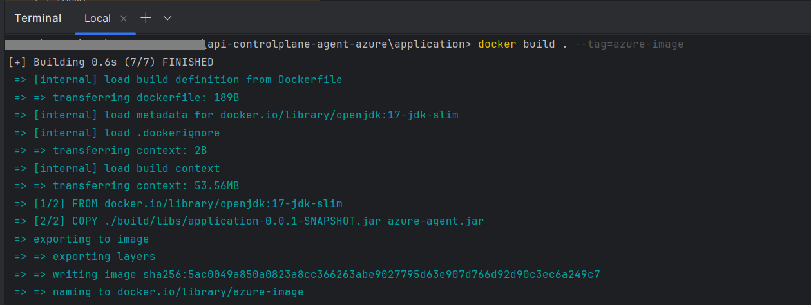

<!--
  Copyright Super iPaaS Integration LLC, an IBM Company 2024
-->

## How to Deploy and Run the Azure Agent as a Spring Boot Application in Docker?

Let’s look at a sample scenario through which you can deploy the Azure agent as a spring boot application in Docker using Visual Studio Code editor. To deploy the Azure agent in Azure Functions, see [How to deploy the Azure Agent in Azure Functions?](../functions)

**Note**: ``` This procedure explains how to deploy the Azure agent as a stand-alone application. ```

## Table of Contents

- [Pre-requisites](#pre-requisites)
- [Deploy and run the Azure Agent as a Spring Boot Application in Docker](#to-deploy-and-run-the-azure-agent-as-a-spring-boot-application-in-docker)
  - [Step 1: Build a Docker image](#step-1-build-a-docker-image)
  - [Step 2: Run the Spring boot application in Docker](#step-2-run-the-spring-boot-application-in-docker)
    - [Environment Variables](#environment-variables)

### Pre-requisites

Ensure that you have:

- Built the Gradle project and the *application-version-SNAPSHOT* Jar is created at *application / build / libs*<br>
  For details about how to build the Jars, see [How to build?](../devops/)
- Started the Docker client.
- API Control Plane, version *11.0.4*
- Verified if Azure API Management Service and API Control Plane for which you want to establish connectivity using the Agent are up and running.
- Created the *Runtime Type* in API Control Plane to represent Azure API Management Service. For details, see [How to create the runtime type?](../docs/runtime_service_mgmt_api.md)
- Assigned the *Service principle* with *Cloud App admin role* for your Azure API Management Service. For details about the Service principles, see [Azure documentation](https://learn.microsoft.com/en-us/azure/api-management/api-management-howto-use-managed-service-identity).

### To deploy and run the Azure Agent as a Spring Boot Application in Docker:

#### Step 1: Build a Docker image.

1.	Go to *webmethods-api-control-plane-agent-azure\application* using the following command in the Visual Studio Terminal:
	 ``` cd application ```

2.	Run the following command to build the Docker image:
	 ``` docker build . --tag=<image-name> ```

	 For example: docker build . --tag=azure-image
	 
      
	 
      Verify if *azure-image* image is listed in the docker client or run the following command to verify if the image is listed in the docker images:

	  ``` docker images ```
	  
	  If *azure-image* appears in the list of Docker images, the image is built successfully.
	 
	 
#### Step 2: Run the Spring boot application in Docker.

1.	Configure a set of properties to establish connection between Azure API Management Service and API Control Plane.

	 Go to *webmethods-api-control-plane-agent-azure\devops\docker-compose* using the following commands in the Visual Studio Terminal:

	 ``` cd devops ```
	 
	 ``` cd docker-compose ```

**.env** and **docker-compose.yml** file contains properties related to Azure API Management Service configurations, Agent configurations, and API Control Plane configurations. 

**Note**: ``` To securely provide sensitive information like passwords in Docker or Kubernetes deployments, use Docker secrets or Kubernetes secrets. Deploy the Docker image accordingly to utilize these secrets for secure password management. ```

**Note**: ``` The following properties apply to both Sprint boot and Azure Functions deployment modes, unless specified otherwise. ```
<br>
<br>

#### Environment Variables

**Azure API Management Service configurations** let you specify  Azure API Management Service configurations required for Azure connectivity.

| Properties | Description |
|--------------------|-------------------|
| AZURE_SUBSCRIPTION_ID| *Mandatory*. The subscription identifier under which your Azure API Management service is created.<br> For details about how to find the subscription ID for your Azure API Management service, see [Azure documentation](https://learn.microsoft.com/en-us/azure/api-management/get-started-create-service-instance).|
| AZURE_RESOURCE_GROUP | *Mandatory*. The container into which Azure API Management resources are deployed and managed.<br> For details about how to find the resource group in which your Azure API Management resources are deployed, see [Azure documentation](https://learn.microsoft.com/en-us/azure/api-management/get-started-create-service-instance). |
| AZURE_TENANT_ID | *Mandatory*.  Azure account ID or organization ID. <br>For details about how to find the tenant id of your Azure account, see [Azure documentation](https://learn.microsoft.com/en-us/azure/azure-portal/get-subscription-tenant-id). |
|AZURE_CLIENT_ID | *Mandatory*. Client ID to authorize Azure SDK connection.<br> The Client ID is generated when you assign the *Service principle* to Azure API Management Service. For details, see [Azure documentation](https://learn.microsoft.com/en-us/azure/api-management/api-management-howto-use-managed-service-identity).|
|AZURE_CLIENT_SECRET | *Mandatory*. Client secret to authorize Azure SDK connection.<br> The Client secret is generated when you assign the *Service principle* to Azure API Management Service. For details, see [Azure documentation](https://learn.microsoft.com/en-us/azure/api-management/api-management-howto-use-managed-service-identity). |
|AZURE_API_MANAGEMENT_SERVICE_NAME | *Mandatory*. A unique name that identifies your Azure API Management instance. <br>The *resource name* that you specify while creating an Azure API Management Service instance is the *AZURE_API_MANAGEMENT_SERVICE_NAME*.<br> For details, see [Azure documentation](https://learn.microsoft.com/en-us/azure/api-management/get-started-create-service-instance).<br> **Note**: AZURE_API_MANAGEMENT_SERVICE_NAME is considered as a runtime name in API Control Plane and the runtime name can not be changed. |
|AZURE_MERTICS_SYNC_BUFFER_INTERVAL_MINUTES| *Optional*. While retrieving the metrics using the Azure SDK, the real-time analytical (metrics) data from the Azure API Management Service may be delayed by 15 minutes or longer, depending on the current service load. For details, see [Azure documentation](https://learn.microsoft.com/en-us/azure/api-management/howto-use-analytics).<br> Therefore, set AZURE_MERTICS_SYNC_BUFFER_INTERVAL_MINUTES to more than *15 minutes*.<br><br> The default value is *15 minutes*. <br>If you do not specify a value for this property, the default value is considered.<br>Specifying a value less than *15 minutes* results in unnecessary calls, as the analytics data may not yet be available.|
|AZURE_METRICS_BY_REQUESTS_OR_INSIGHTS|*Optional*. Method in which the metrics are retrieved from Azure SDK.<ul><li>Requests</li><li>Insights</li></ul><br>**Requests**: The agent uses the *reports().listByRequest* method to retrieve all requests in the specified time interval. The agent builds API Control Plane compatible metrics such as *transactionsCount*, *averageLatency*, and *averageResponseTime*, categorizing them according to the status code *2xx*, *3xx*, *4xx*, and *5xx* before sending them to API Control Plane.<br><br>**Insights**: The agent uses *reports().listByTime* or *reports().listByApi* method to retrieve the aggregated metrics data report in *15 minute intervals* (15, 30, 45). However, this method does not categorize the data according to the status codes.<br><br>The default value is *Requests*. <br>If you do not specify a value for this property, the default value is considered.  |

**API Control Plane configurations** let you specify API Control Plane details to which Azure API Management Service must establish the connectivity.

| Properties | Description | 
|--------------------|-------------------|
| APICP_URL |	*Mandatory*. The valid URL that is used to access API Control Plane. <br> Example: https://localhost:8080 |
| APICP_USERNAME | *Mandatory*. Username that is used to log in to API Control Plane. |
| APICP_PASSWORD | *Mandatory*. Password of the corresponding username, which is used for logging into the API Control Plane through basic authentication.|
| APICP_TOKEN| *Optional*. A valid token that is used to authorize API Control Plane application. This property represents token-based authorization.<br> **Note**: Use either Basic authorization (APICP_PASSWORD) or token-based authorization (APICP_TOKEN) to authorize the API Control Plane application. |	 
| APICP_SSL_ENABLED |*Optional*. The SSL certification of API Control Plane.<br> Possible values: *true* or *false*|
| APICP_TRUSTSTORE_PATH |*Optional*.Location of the truststore file.<br> If *APICP_SSL_ENABLED* property is set to *true*, you must specify a value for this property.|
| APICP_TRUSTSTORE_PASSWORD |*Optional*. Password to access the truststore file.<br>If *APICP_SSL_ENABLED* property is set to *true*, you must specify a value for this property. |
| APICP_TRUSTSTORE_TYPE|*Optional*. Type of the truststore.<br>If *APICP_SSL_ENABLED* property is set to *true*, you must specify a value for this property.|	
| APICP_KEYSTORE_PATH |*Optional*. Location of the keystore file.<br>If *APICP_SSL_ENABLED* property is set to *true*, you must specify a value for this property.|	 
| APICP_KEYSTORE_PASSWORD |*Optional*.Password to access the keystore file.<br>If *APICP_SSL_ENABLED* property is set to *true*, you must specify a value for this property.|
| APICP_KEYSTORE_TYPE |*Optional*. Type of the keystore.<br>If *APICP_SSL_ENABLED* property is set to *true*, you must specify a value for this property. |
| APICP_KEY_ALIAS |*Optional*. Alias of key in the keystore.<br>If *APICP_SSL_ENABLED* property is set to *true*, you must specify a value for this property.|	
| APICP_KEY_PASSWORD |*Optional*. Password of key in the keystore.<br>If *APICP_SSL_ENABLED* property is set to *true*, you must specify a value for this property.|	


**Agent configurations** let you specify the agent configurations such as heart beat interval, assets sync interval, metrics sync interval, and so on.

| Properties | Description | Possible Values |
|--------------------|-------------------|-------------------|
| APICP_HEARTBEAT_SEND_INTERVAL_SECONDS |*Optional* The duration in seconds in which the agent must send the health check status (heartbeats) of the Azure API Management Service to API Control Plane. | Min: *15 seconds* <br>Max: *900 seconds* (5 minutes).<br> Default: 60 seconds <br><br>If you do not specify a value for this property, the default value is considered.<br><br> In **Azure Functions**: <ul><li>*APICP_HEARTBEAT_SEND_INTERVAL_SECONDS*: Add this property and specify a value for this property in seconds.</li><li>*APICP_HEARTBEAT_SEND_INTERVAL_CRON*: Add this property and specify the value as a *cron expression* matching the interval specified in *APICP_HEARTBEAT_SEND_INTERVAL_SECONDS*.<br><br> For example: If *APICP_HEARTBEAT_SEND_INTERVAL_SECONDS* is set to *60 seconds*, then APICP_HEARTBEAT_SEND_INTERVAL_CRON should be set to 0 */1 * * * * |
| APICP_PUBLISH_ASSETS  |*Optional* Enable or disable the publishing of assets (APIs) to API Control Plane.| <ul><li>*true*</li><li>*false* (Default value)</li></ul><br>Assets are published to API Control Plane whenever the Agent starts, provided that **APICP_PUBLISH_ASSETS** is set to *true*.<br><br> If you do not specify a value for this property, the default value is considered.<br><br> *This property is not applicable for Azure Functions deployment*.|
| APICP_SEND_METRICS   |*Optional* Enable or disable syncing of Azure analytical data (metrics) to API Control Plane. | <ul><li>*true*</li><li>*false* (Default value)</li></ul><br><br> If you do not specify a value for this property, the default value is considered. <br><br> *This property is not applicable for Azure Functions deployment*.|
| APICP_METRICS_SEND_INTERVAL_SECONDS   |*Optional* The duration in seconds in which the agent must retrieve the metrics from Azure API Management Service using Azure SDK and send metrics to API Control Plane. |Min: *60 seconds*<br>Max: *7200 seconds* <br>Default: *300 seconds* <br><br>If you do not specify a value for this property, the default value is considered. <br><br>In **Azure Functions**: <ul><li>*APICP_METRICS_SEND_INTERVAL_SECONDS*: Add this property and specify a value for this property in seconds.</li><li>*APICP_METRICS_SEND_INTERVAL_CRON*: Add this property and specify the value as a *cron expression* matching the interval specified in *APICP_METRICS_SEND_INTERVAL_SECONDS*.<br><br> For example: If *APICP_METRICS_SEND_INTERVAL_SECONDS* is set to *120 seconds*, then APICP_METRICS_SEND_INTERVAL_CRON should be set to 0 */2 * * * |
| APICP_ASSETS_SYNC_INTERVAL_SECONDS   |*Optional* The duration in seconds in which the Agent must synchronize the changes made to the assets from the Azure API Management Service to API Control Plane using the Azure SDK. |Min: *60 seconds* (Default value)<br>Max: *21600 seconds* (6 hours). <br><br>If you do not specify a value for this property, the default value is considered. |
| APICP_SYNC_ASSETS   |*Optional* Enable or disable syncing of assets (APIs) to API Control Plane. | <ul><li>*true*</li><li>*false* (Default value)</li></ul><br>Assets are synchronized periodically according to the configured synchronization values. Within each synchronization interval, only the assets that are newly created, updated, or deleted are synchronized with API Control Plane.<br><br>If you do not specify a value for this property, the default value is considered.|
| APICP_RUNTIME_CAPACITY_VALUE   | *Optional*. The approximate estimate of the throughput that a runtime can handle for the specified duration.| Default value: *500000* <br><br>If you do not specify a value for this property, the default value is considered. |
| APICP_RUNTIME_CAPACITY_UNIT  | *Optional*. Choose the unit of duration in which the capacity must be defined. | Possible values are as follows:<ul><li>*PER_SECOND*</li><li>PER_MINUTE </li><li>*PER_HOUR*</li><li>*PER_DAY* </li><li>*PER_WEEK*</li><li>*PER_MONTH* </li><li>*PER_YEAR* (Default value)</li></ul><br><br>If you do not specify a value for this property, the default value is considered.|
| APICP_RUNTIME_TYPE_ID | *Mandatory*. The Id of the runtime type. | Ensure to verify if the runtime type exists in API Control Plane. If it does not exist, use the Runtime Type Management Service REST API to add the runtime type. For details, see [How to create the runtime type?](../docs/runtime_service_mgmt_api.md) |	
| APICP_LOG_LEVEL | *Optional*. The level of logs to be captured.| <ul><li>*ALL*</li><li>*ERROR*</li><li>*INFO* (Default value)</li><li>*TRACE*</li></ul><br><br>If you do not specify a value for this property, the default value is considered.|	


2. Run the following command:

	``` docker-compose up -d ```

	 The output must be as follows:


The Azure agent application starts. 

3. Verify if Azure API Management Service(runtime) is registered with the API Control Plane and if the APIs and metrics are published and synchronized with API Control Plane respectively.

   1. Open the API Control Plane application.
   2. Click on the **Runtimes** tab.<br>
   3. Check if the runtime is registered with API Control Plane by verifying if the *AZURE_API_MANAGEMENT_SERVICE_NAME* (specified in the .env file) is listed in the          *Manage Runtimes* page. If the runtime is listed, it indicates that the runtime is successfully registered with the API Control Plane.<br>
   4. Check if the runtime's health status is sent to API Control Plane by verifying the status of that corresponding runtime in the Status column.
      The status appears *green* only if the runtime is up and the heartbeats (status) are received successfully by API Control Plane.<br>
   5. Check if the APIs are published from the runtime to API Control Plane by clicking **Action menu** > **Details** of the corresponding runtime for which, you want 	     to verify if its APIs are published to API Control Plane.
   9. Click **APIs** tab.<br>
      A list of all the APIs associated with the runtime appears. You can also view the runtimes and its associated APIs in the *Manage APIs* page.<br>
   10. Check if the API metrics are synchronized from the runtime to API Control Plane by clicking the icon under the **Action** column corresponding to the runtime    	for which, you want to verify if the metrics are published to API Control Plane.
       The *Runtime-specific* monitor page renders the metrics of that runtime pertaining to a specified time interval. It lists the metrics such as *Transactions*, 	    *Error rate*, *Availability*, *Response time*, and so on. For details, see [Monitoring Runtimes](https://docs.webmethods.io/apicontrolplane/manage_runtimes/chapter5wco/#monitoring-a-specific-runtime&gsc.tab=0).


