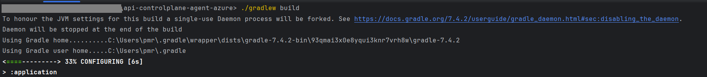

<!--
  Copyright Super iPaaS Integration LLC, an IBM Company 2024
-->

## How to build the Gradle project?

Let’s look at a sample scenario through which you can build a Gradle project using Visual Studio Code editor.

**Pre-requisites** 

Ensure that you have

- Cloned **webmethods-api-control-plane-agent-azure** Git Hub repository using any GIT client.
- Empower portal login credentials to download the Agent SDK Jars. For details, see [How to access Agent SDK Jars](https://docs.webmethods.io/apicontrolplane/agent_sdk/chapter2wco#ta-implementing_agentsdk).
- Installed **Java 17** and Gradle **7.4.2**<br>
  If you plan to upgrade Gradle, ensure that you also upgrade the supported Java version accordingly. For details about the compatibility between Java and Gradle     versions, see [Compatibility Matrix](https://docs.gradle.org/current/userguide/compatibility.html).

**To build the Gradle project**

1.	Unzip Agent SDK folder downloaded from the Empower portal and place the (api, core, and model) Jars under *libs* folder in the cloned repository.

2.	Open Visual Studio Code editor.

3.	Go to **File > Open Folder** and select the cloned **webmethods-api-control-plane-agent-azure** repository.

4.	Run the following command in the Visual Studio Terminal to build the project:

	 ``` gradle build ``` (if you have installed Gradle globally)  (or) ``` ./gradlew build ```

	 

   	*Build Successful* message appears, and the following Jars are created for the application and Azure functions:

   	**Spring Boot application**: **application-version-SNAPSHOT** is created at *application / build / libs* <br>
   
  	 **Azure Functions**: Jars and dependencies are generated in *Function / build*<br>
   
   	**Troubleshooting Tips**: For permission denied issues: <br>
     		1. Verify if the Gradle has execution permissions. <br>
	 	2. Run ``` gradle build ``` (or) ``` ./gradlew build ```<br>
	 	3. If the issue persists, run:
	    	``` sh ./gradlew build ```
	    	(or) 
		``` bash .gradlew build ```


	

