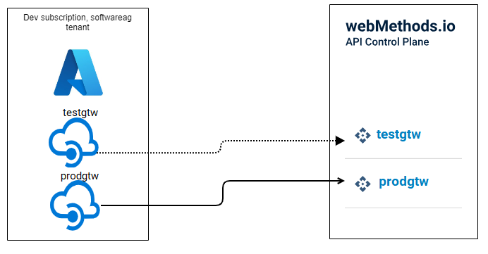

<!--
  Copyright Super iPaaS Integration LLC, an IBM Company 2024
-->

## Co-relation between Azure API Management Service  and API Control Plane terminologies

| Azure API Management Service | API Control Plane | Description |
|--------------------|-------------------|-------------|
| Azure Subscription ID and API Management Service  |Runtime | A combination of Azure subscription ID and API Management service is considered as a runtime in API Control Plane. The subscription ID is the identifier under which your Azure API Management service is created. For details about the subscription ID, see [Azure API Management documentation](https://learn.microsoft.com/en-us/azure/azure-portal/get-subscription-tenant-id#find-your-azure-subscription). |
| Azure API Management Service name | Runtime name | The Azure API Management Service name or Resource name is considered as a runtime name in API Control Plane. |
| Revisions | API Versions | A Revision in Azure API management service tracks the changes to the version of an API. An API in Azure API Management Service can have multiple revisions, but only one can be set as the *current* revision. For details about the Revisions, see [Azure API Management documentation](https://learn.microsoft.com/en-us/azure/api-management/api-management-revisions). **Note**: Only the APIs that are set as *current* revision are synchronized with the API Control Plane.  |

Every Azure API Management Service is considered as a separate runtime in the API Control Plane. Hence, you must deploy an agent for each Azure API Management Service. 

For example, assume that you have two API Management Services named, *testgtw* and *prodgtw* under *dev* subscription. You must deploy an agent each for *testgtw* and *prodgtw*. The following diagram explains how API Management Services are treated as different runtimes in the API Control Plane:

