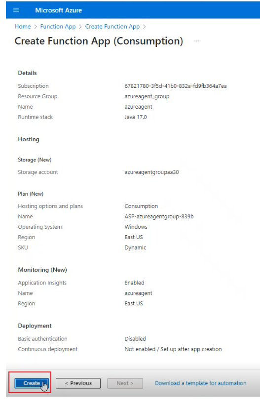
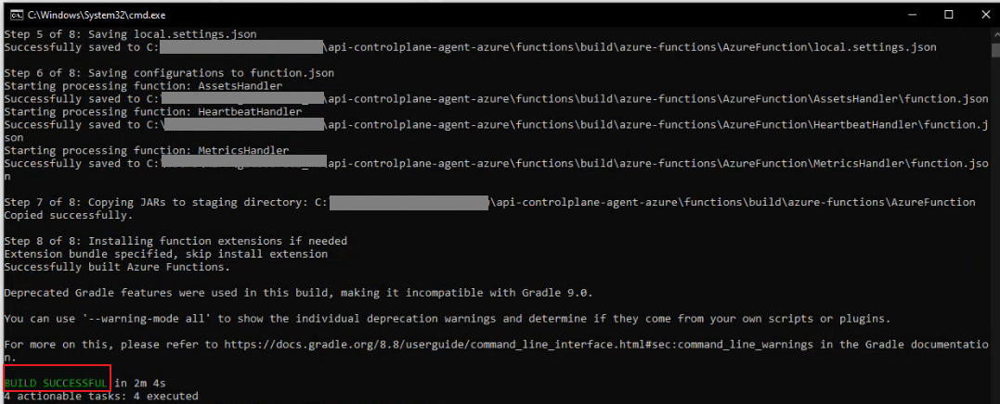

## How to Create and Deploy Java Function in Azure using Azure CLI and Visual Studio Code Editor?

Let’s look at a sample scenario through which you can configure an Azure function, **azureagent** and deploy the functions using **Azure CLI** and **Visual Studio Code Editor**.

## Table of Contents

- [Pre-requisites](#pre-requisites)
- [Create and Deploy Java function in Azure using Azure CLI and Visual studio Code editor](#to-create-and-deploy-java-function-in-azure-using-azure-cli-and-visual-studio-code-editor)
  - [Step 1: Create Functions](#step-1-create-functions)
  - [Step 2: Configure the Environment variables](#step-2-configure-the-environment-variables)
  - [Step 3: Deploy Azure agent code into Azure Functions using Azure CLI and Visual Studio Code Editor](#step-3-deploy-azure-agent-code-into-azure-functions-using-azure-cli-and-visual-studio-code-editor)<br>
      - [Deploy using Azure CLI](#deploy-using-azure-cli)<br>
      - [Deploy using Visual Studio Code Editor](#deploy-using-visual-studio-code-editor)
  - [Step 4: Configure event-based trigger for AssetsHandler function using Azure Subscription service](#step-4-configure-event-based-trigger-for-assetshandler-function-using-azure-subscription-service)
  - [Step 5: Configure the Event subscription in your Azure API Management Service](#step-5-configure-the-event-subscription-in-your-azure-api-management-service)
    

### Pre-requisites

Ensure that you have:

-	Built the Gradle project and the required Jars are created. For details about how to build the Jars, see [How to build?](../devops/)
-	API Control Plane, version *11.0.4*
-	An active Azure account with API Management service subscription.
-	Verified if Azure API Management service and API Control Plane for which you want to establish connectivity using the agent are up and running.
-	Created the Runtime Type in API Control Plane to represent Azure API Management Service. For details, see [Runtime Type Management REST API](https://github.com/SoftwareAG/webmethods-api-control-plane/blob/main/apis/openapi-specifications/runtime-type.yaml).
-	Assigned the *Service principle* with **Website Contributor role** for your Azure API Management Service. For details about the Service principles, see [Azure documentation]( https://learn.microsoft.com/en-us/azure/api-management/api-management-howto-use-managed-service-identity).

For **Azure CLI**, ensure that you have installed
-	Microsoft Azure CLI, latest version. For details, see [Azure Command-Line Interface (CLI)](https://learn.microsoft.com/en-us/cli/azure/).
-	Node.js, latest version. (Node.js is required for packaging and deploying the agent code in Azure Functions.) 
-	Gradle 7.4.2. 

For **Visual Studio Code Editor**, ensure that you have installed Azure Functions extension.<br>

### To create and deploy Java function in Azure using Azure CLI and Visual studio Code editor

#### Step 1: Create Functions.

*This step is common for creating Java Function in Azure using Azure CLI and Visual Studio Code editor.*

A) Search for **Azure Function App** in the Search bar in Azure services console.
	
B) Click **Create**.
	

	
C) Select **Consumption** as the hosting option.

D) Click **Select**.

E) Edit the following details under **Basics** tab in the **Instance Details** section: 
- **Function App Name**. Enter a name that describes the purpose of your function. For example, *azureagent*
- **Runtime stack**. Choose *Java* as the language to write your function.
- **Version**. Choose *17.0* as the version.
- **Operating System**. Choose *Windows*.
	
F) Click **Review + Create**.


If you require additional configurations such as *Storage*, *Networking*, and so on, you can navigate to the respective sections and configure.
	
G) Click **Create**.



This step takes a few minutes to create the Function, *azureagent*.

 

Once created, *azureagent* is listed in the *Function App*.<br><br><br>
		

#### Step 2: Configure the Environment variables.

*This step is common for creating and deploying Java Function in Azure using Azure CLI and Visual Studio Code editor*.

Environment variables include *Azure API Management service*, *agent*, and *API Control Plane* configurations. These configurations are required to connect Azure API Management Service with API Control Plane.

A) Open **azureagent** in the Function App.

B) Click **Settings > Environment variables** from the left navigation pane.

C) Click **Add** and specify the following in the **Add/edit application settings** page:

  - **Name**. Enter the name of the environment variable.
	
  - **Value**. Specify a value for the property.
	
  - Click **Apply**.
	
  

For details about the environment variables and recommended values, see [How to run the Spring Boot application in Docker?](../application) 

D) Click **Apply** in the Environment variables page.
	
The next step is to deploy your Azure agent code into Azure Functions.<br><br><br> 


#### Step 3: Deploy Azure agent code into Azure Functions using Azure CLI and Visual Studio Code Editor.

You can choose the tool from which you want to deploy based on your requirement.<br><br>

#### Deploy using Azure CLI

The following procedure describes the steps required to deploy using Azure CLI.

A) Open Command Prompt.

B) Run the following command to verify if Azure CLI is installed:
	
  ``` az –-version ```
	
  If Azure CLI version is listed, it indicates that Azure CLI is installed successfully.	
   
C) Run the following command to logon to your Azure account. 
  
  ``` az login ```	

D) Enter valid Azure account credentials in which, your Azure API Management service (that you want to connect with API Control Plane) is hosted.<br>
   If you have logged on to your Azure account successfully, all the subscriptions under that account displays in an order.
   
E) Type the number of the subscription to which, you want to deploy the SDK agent code in Azure Functions.
    
	
   Azure CLI authorizes the Azure account.	
	
F) Run the following command to verify if **node** is installed in your system:
  
  ``` node –-version ```
  
   If node version is listed, it indicates that **node** is installed successfully. Else, re-install node.
	
G) Run the following command to install NPM package, which is required to package and deploy the agent code in Azure Functions:

  ``` npm install -g azure-functions-core-tools@4 --unsafe-perm true ```
  
   where:<br>
   *azure-functions-core-tools@4* is the *NPM package*.
    
   
   **Note**: Ensure to install the latest NPM package from [NPM registry](https://www.npmjs.com/package/azure-functions-core-tools).
   
H) Open command prompt from the following location, *api-controlplane-agent-azure\functions* in your cloned Azure repository and run the following command:
   
   ``` gradle azureFunctionsPackage ```
   
**Note**: This command runs successfully only if you have installed Gradle.
 
	
This command builds the Function artifacts from the agent code. That is, it creates **AzureFunction** directory in the following location, *api-controlplane-agent-azure\functions\build\azure-functions*. The **AzureFunction** directory contains the following artifacts that are required for performing Azure agent's use cases.
  
  
	
  The next step is to deploy the artifacts built with *Azure CLI* to *Azure Functions* App.
  
I) Open command prompt from the following location, *api-controlplane-agent-azure\functions\build\azure-functions\AzureFunction* in your cloned Azure repository and run the following command: 

  ``` func azure functionapp publish <functions-app-name> --java ```
  
  where:<br>
  *functions-app-name* is the name of the *Functions App* that you created. For example: *func azure functionapp publish azureagent –java* 
This step deploys the artifacts in Azure Functions App, *azureagent*.<br><br>

#### Deploy using Visual Studio Code Editor

*Ignore this procedure if you have deployed using Azure CLI.*

The following procedure describes the steps required to deploy using Visual Studio Code Editor.

1) Install **Azure Functions extension** in Visual Studio Code editor.

	1. Open Visual Studio Code editor.
	2. Click **Extensions** from the left navigation pane.
	3. Search for **Azure Functions** in the search bar.
	4. Click **Install** under Azure Functions.
	
  
	
  *Azure Functions App* extension is added in the left navigation pane.
	
2) Sign into your Azure account in which, your Azure API Management service (that you want to connect with API Control Plane) is hosted.
	
   Click **Azure Functions App extension** > **Sign in to Azure** and provide your *Azure account credentials*.
	
   
	
   The subscriptions within the Azure account are listed.
	
   
	
3) Build function artifacts from the agent code.

   Expand **Local project** > **Functions** in the *workspace* and click **Run build task to update this list**.  
   
   The following function artifacts are created and listed in the workspace:
   - **AssetsHandler**
   - **HeartbeatHandler**
   - **MetricsHandler**
   
4) Deploy the artifacts in the Azure Functions App.

	1. Click **Deploy to Azure** in the right pane, next to *Local project* in the *workspace*.
	2. Select the Azure Functions App, *azureagent* that is created.
	   
	   
	
	3. Click **Deploy** to confirm deployment to *azureagent* in the pop-up window that appears. 
           This deploys all function artifacts to Azure Functions App, *azureagent* successfully.
	   
	   
	
	Once the artifacts are deployed to Azure Functions App, *azureagent*, the **HeartbeatHandler** and **MetricsHandler** Azure functions are triggered based on 	     the *cron expression* set in the environment properties. When these Azure Functions are triggered, their core application logic executes, retrieving the 		heartbeats(status) and metrics from Azure API Management Service and sending them to API Control Plane. 
	
	Since the **AssetsHandler** function is based on the **event trigger**, this function must be linked to the *Azure API Management* service from which you want 	       to establish connection to API Control Plane.<br><br><br>
	

#### Step 4: Configure event-based trigger for AssetsHandler function using Azure Subscription service.

*This step is common for creating and deploying Java Function in Azure using Azure CLI and Visual Studio Code editor.*

a) Go to the **Home** page in your Azure account.

b) Search for **Subscriptions** in the Search bar in Azure services console.

c) Select the **subscription name** in which your Azure API Management service is hosted.

   
   
d) Click **Resource providers** from the left navigation pane.

e) Select **Microsoft.EventGrid** from the dropdown.

f) Enable **Microsoft.EventGrid** and click **Register**.<br><br><br>
	
#### Step 5: Configure the Event subscription in your Azure API Management Service.

*This step is common for creating and deploying Java Function in Azure using Azure CLI and Visual Studio Code editor.*

a) Open the **Azure API Management Service** from which you want to establish connection to API Control Plane.

b) Click **Events**.

c) Click **+ Event Subscription**.

   The **Create Event Subscription** page appears.
   
d) Enter the following details under **Basics** tab in the **Create Event Subscription** page:
		
   - **Name**. Name of the event subscription.
   - **Event Types**. Select the following in Filter to Event Types check box. 
	 - *API Management Service Created*
	 - *API Management Service Updated*
	 - *API Management Service Deleted*
	Each time, the corresponding activity occurs in Azure API Management service, an event is created that triggers the **AssetsHandler** function.
   - **Endpoint Type**. Select *Azure* Function.
   - **Endpoint**. Associate this event subscription with the Azure Function, *azureagent*. Edit the following fields as required in the **Select Azure Function** screen:
	  - **Subscription**. Select the subscription in which your Azure account is hosted.
	  - **Resource group**. Select the corresponding resource group name.
	  - **Function app**. Select the Function App, to which the event subscription must associate with. For example, *azureagent*.
	  - **Function**. Choose the function as *AssetHandler*.
	  - Click **Confirm Selection**.
	   
	
e) Click **Create**.

This triggers **AssetsHandler** function whenever the activities chosen in the **Event subscription** occurs in Azure API Management Service. When the Functions trigger based on the cron expression and event subscription, the application logic of the respective functions are executed automatically, establishing the connection between the Azure API Management Service and API Control Plane.
Additionally, if you want to troubleshoot the executions of the Azure functions, the **Logs** tab within the Azure function enables you to monitor the logs and the Metrics section in your Azure API Management Service enables you to analyze all the metrics.
	
f) Verify if Azure API Management Service (runtime) is registered with the API Control Plane and if the APIs and metrics are published and synchronized with API Control Plane respectively.

 1. Open the **API Control Plane** application.
	
 2. Click on the **Runtimes** tab.
	
3. Check if the runtime is registered with API Control Plane by verifying if the *AZURE_API_MANAGEMENT_SERVICE_NAME* (specified in the .env file) is listed in  the        **Manage Runtimes** page. If the runtime is listed, it indicates that the runtime is successfully registered with the API Control Plane.
    
4. Check if the runtime's health status is sent to API Control Plane by verifying the status of that corresponding runtime in the Status column. The status        	      appears **green** only if the runtime is up and the heartbeats (status) are received successfully by API Control Plane.
    
 5. Check if the APIs are published from the runtime to API Control Plane by clicking **Action menu** > **Details** of the corresponding runtime for which, you            want to verify if its APIs are published to API Control Plane.
    
6. Click **APIs** tab.
    
7. A list of all the APIs associated with the runtime appears. You can also view the runtimes and its associated APIs in the **Manage APIs** page.
    
8. Check if the API metrics are synchronized from the runtime to API Control Plane by clicking the icon under the **Action column** corresponding to the 	    runtime for which, you want to verify if the metrics are published to API Control Plane. The **Runtime-specific monitor** page renders the metrics of that   	    runtime pertaining to a specified time interval. It lists the metrics such as *Transactions*, *Error rate*, *Availability*, *Response time*, and so on. For 	   details, see [Monitoring Runtimes](https://docs.webmethods.io/apicontrolplane/manage_runtimes/chapter5wco/#monitoring-a-specific-runtime).


